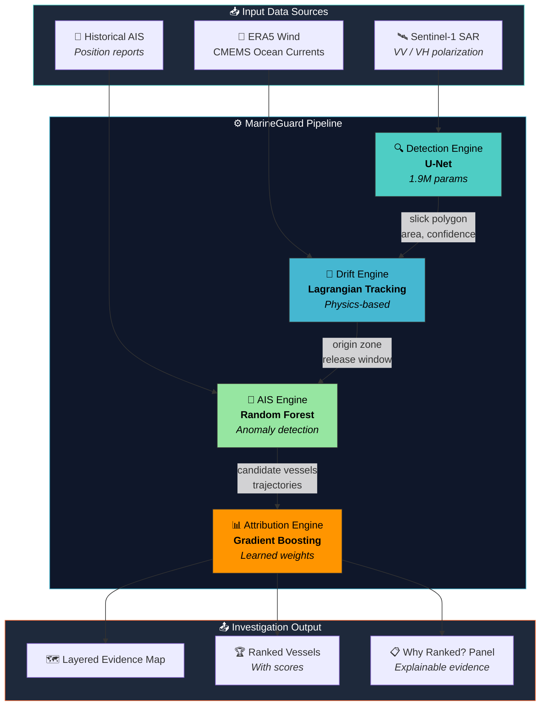
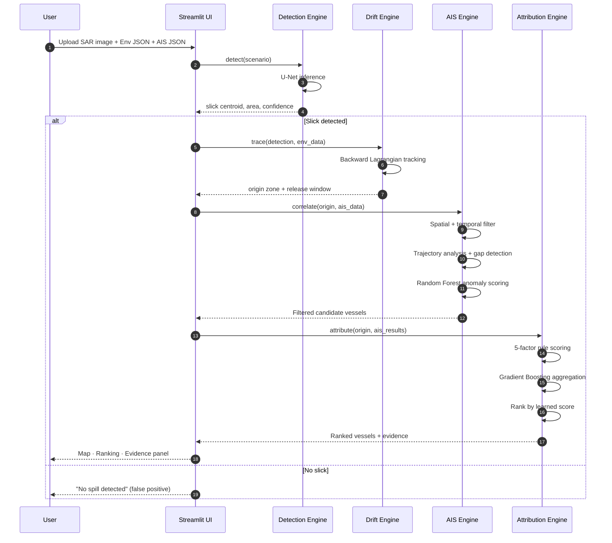
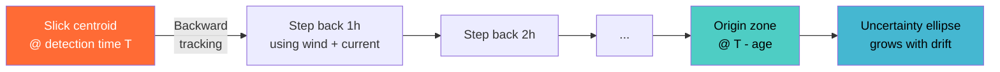
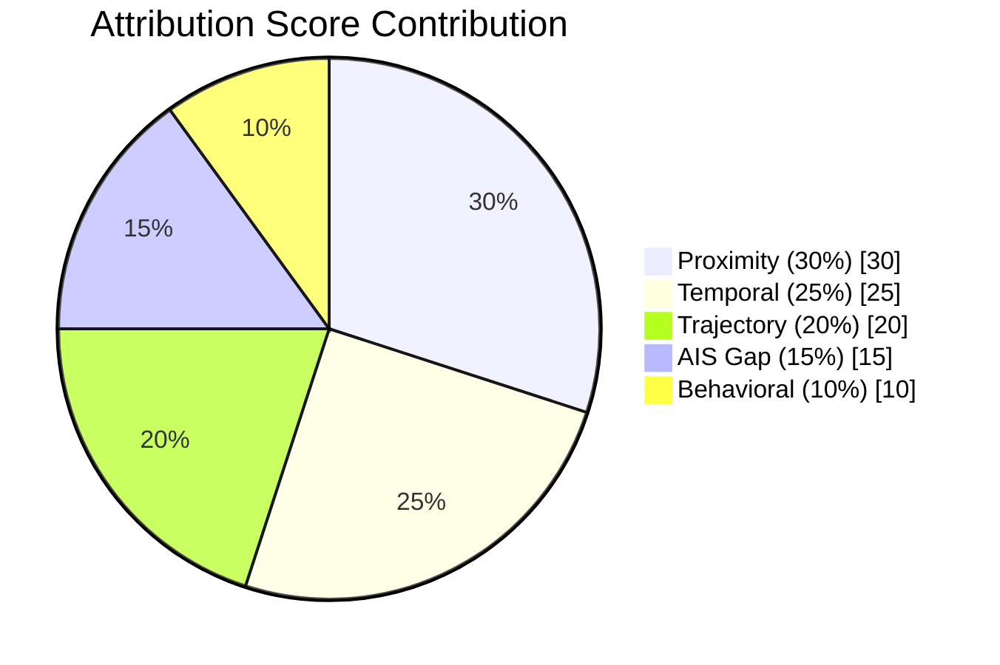

<div align="center">

# 🛢️ MarineGuard

### From Slick Detection to Maritime Evidence

**An end-to-end intelligent platform that investigates marine oil spills using Sentinel-1 SAR imagery, environmental data, and historical AIS vessel traffic.**

[](https://www.python.org/)
[](https://pytorch.org/)
[](https://streamlit.io/)
[](https://scikit-learn.org/)
[](LICENSE)

**Team Ocean X** · **Smart India Hackathon 2026** · **PS 26143 (NTRO)**

</div>

---

## 📖 Table of Contents

- [Problem Statement](#-problem-statement)
- [Solution Overview](#-solution-overview)
- [Architecture](#-architecture)
- [Investigation Pipeline](#-investigation-pipeline)
- [ML Models](#-ml-models)
- [Technology Stack](#-technology-stack)
- [Project Structure](#-project-structure)
- [Installation](#-installation)
- [Usage](#-usage)
- [Results & Metrics](#-results--metrics)
- [Innovation](#-innovation)
- [Team](#-team)

---

## 🎯 Problem Statement

> **PS 26143 (NTRO):** *"Leveraging satellite imagery to determine Oil spills at sea along with AIS data correlations to identify vessel responsible for the spill."*

**Marine oil spills inflict great damage on marine ecosystems** and often remain unattributable to the vessel causing them. The core challenge is to:

1. **Detect** oil spills from satellite imagery (SAR + EO).
2. **Characterise** the slick — geometric properties, area, age.
3. **Trace** the slick backward to estimate its origin and release time.
4. **Correlate** with historical AIS traffic to identify the responsible vessel.
5. **Produce explainable evidence** that is legally defensible.

### Why It Matters

| Historical Incident | Impact |
|---|---|
| **American Trader (1990)** | ~417,000 gallons spilled · ~3,400 birds killed · 15 miles of beach polluted |
| **Deepwater Horizon (2010)** | 4.9M barrels · $65B in cleanup and damages |
| **Chennai Port bilge dumps (ongoing)** | Chronic undetected operational discharges |

---

## 💡 Solution Overview

**MarineGuard** is a full investigation pipeline that turns a raw Sentinel-1 SAR image into a ranked list of candidate vessels with transparent, factor-based evidence.

### The MarineGuard Principle

> *"Finds the vessel that best fits the incident, not just the closest."*

We never suspect a vessel based on proximity alone — our **Explainable Attribution Score** requires **multiple corroborating factors** for a high-confidence finding.

### The Five Stages

| Stage | Name | Description |
|:---:|:---|:---|
| **1** | 🔍 **Detect** | U-Net segmentation on SAR → slick location, area, confidence |
| **2** | 🌊 **Trace** | Lagrangian particle tracking backward through wind + currents → origin zone |
| **3** | 🚢 **Correlate** | Spatial-temporal filtering of historical AIS traffic + ML anomaly detection |
| **4** | 📊 **Rank** | Multi-factor attribution scoring (Gradient Boosting) |
| **5** | 📋 **Explain** | Per-vessel "Why Ranked?" evidence panel with forensic timeline |

---

## 🏗️ Architecture



---

## 🔬 Investigation Pipeline



### Drift Reconstruction (Physics Model)



**Formula:**  
`drift_vector = 0.03 × wind_vector + 1.0 × current_vector`  
(Wind contributes ~3% via Ekman drift; current contributes fully.)

---

## 🤖 ML Models

MarineGuard uses **three trained ML models**, all trained locally on CPU in under 2 minutes.

### 1️⃣ U-Net — Oil Slick Segmentation

| Property | Value |
|:---|:---|
| **Task** | Pixel-wise binary segmentation (oil / no-oil) |
| **Input** | 128×128 grayscale SAR image |
| **Output** | 128×128 probability map |
| **Architecture** | Encoder-Decoder with skip connections |
| **Feature channels** | 16 → 32 → 64 → 128 → 256 → 128 → 64 → 32 → 16 |
| **Parameters** | ~1.94M |
| **Model size** | ~7.4 MB (FP32) |
| **Loss** | BCE + Dice (0.5 / 0.5) |
| **Optimizer** | Adam (lr=1e-3, ReduceLROnPlateau) |
| **Training data** | 350 synthetic SAR images (200 positive, 150 negative) |

### 2️⃣ Random Forest — AIS Anomaly Detection

| Property | Value |
|:---|:---|
| **Task** | Binary classification (suspicious / normal) |
| **Features** | 10 (avg speed, variance, gaps, loitering, alignment, etc.) |
| **Trees** | 100 |
| **Max depth** | 8 |
| **Training samples** | 2,000 |

### 3️⃣ Gradient Boosting — Attribution Scoring

| Property | Value |
|:---|:---|
| **Task** | Binary classification (culprit / innocent) |
| **Features** | 5 (proximity, temporal, trajectory, AIS gap, behavioral) |
| **Estimators** | 100 |
| **Max depth** | 4 |
| **Learning rate** | 0.1 |
| **Training samples** | 3,000 |

### Attribution Score Weights



---

## 🧰 Technology Stack

<div align="center">

| Category | Technologies |
|:---|:---|
| **Satellite Data** | Sentinel-1 SAR · Copernicus |
| **Environmental** | ERA5 (wind) · CMEMS (currents) |
| **Deep Learning** | PyTorch · U-Net · NumPy |
| **Classical ML** | scikit-learn · joblib |
| **Geospatial** | GeoPandas · Shapely · Haversine |
| **Visualization** | Plotly · Matplotlib · Folium |
| **Frontend** | Streamlit |
| **Deployment** | Streamlit Cloud · GitHub |

</div>

---

## 📁 Project Structure

```
MarineGuard/
│
├── app.py                          # 🎨 Streamlit investigation UI
├── config.py                       # ⚙️ Global configuration
├── requirements.txt                # 📦 Python dependencies
├── README.md                       # 📖 This file
├── .gitignore                      # 🚫 Git exclusions
│
├── engines/                        # 🧠 Core pipeline engines
│   ├── detection_engine.py         #    U-Net inference
│   ├── drift_engine.py             #    Backward drift modelling
│   ├── ais_engine.py               #    AIS filtering + ML anomaly
│   └── attribution_engine.py       #    Multi-factor scoring
│
├── models/                         # 🤖 Trained model artifacts
│   ├── unet.py                     #    U-Net architecture
│   ├── unet_weights.pth            #    Trained U-Net (~7.4 MB)
│   ├── ais_anomaly_model.pkl       #    Random Forest classifier
│   └── attribution_model.pkl       #    Gradient Boosting classifier
│
├── utils/                          # 🔧 Utilities
│   ├── geo_utils.py                #    Haversine, bearing, polygons
│   ├── visualization.py            #    Maps + charts
│   └── data_loader.py              #    JSON loading
│
├── data/                           # 📊 Datasets & generators
│   ├── generate_sar_dataset.py     #    Synthetic SAR image + mask
│   ├── generate_ml_training_data.py#    Tabular ML features
│   ├── generate_test_samples.py    #    6 test case folders
│   │
│   ├── sar_dataset/                #    U-Net training data
│   │   ├── images/                 #    350 SAR PNGs
│   │   ├── masks/                  #    350 ground-truth masks
│   │   ├── samples/                #    Side-by-side visuals
│   │   └── dataset_metadata.csv
│   │
│   ├── ml_data/                    #    Tabular ML data
│   │   ├── ais_features.csv
│   │   └── attribution_features.csv
│   │
│   └── test_samples/               #    6 end-to-end test cases
│       ├── 01_clear_ocean/
│       ├── 02_biogenic_film/
│       ├── 03_large_slick/
│       ├── 04_large_irregular_slick/
│       ├── 05_small_slick/
│       └── 06_thin_streak/
│           ├── sar.png
│           ├── environmental.json
│           └── ais.json
│
├── reports/                        # 📈 Evaluation artifacts
│   ├── training_curves.png
│   ├── training_history.csv
│   ├── training_summary.json
│   ├── eval_confusion_matrix.png
│   ├── eval_roc_curve.png
│   ├── eval_pr_curve.png
│   ├── eval_predictions_grid.png
│   ├── eval_metrics.csv
│   └── eval_summary.json
│
├── train_unet.py                   # 🚂 U-Net training
├── train_ais_anomaly.py            # 🌲 Random Forest training
├── train_attribution.py            # 🌳 Gradient Boosting training
├── train_all.py                    # 🎯 Train everything
├── evaluate_model.py               # 📊 Comprehensive evaluation
└── verify_pipeline.py              # ✅ Pipeline smoke test
```

---

## 🚀 Installation

### Prerequisites

- Python **3.10+**
- pip
- ~2 GB free disk space (mostly PyTorch)

### 1. Clone the repository

```bash
git clone https://github.com/<your-username>/MarineGuard.git
cd MarineGuard
```

### 2. Create a virtual environment

```bash
# Windows
python -m venv venv
venv\Scripts\activate

# macOS / Linux
python3 -m venv venv
source venv/bin/activate
```

### 3. Install dependencies

```bash
pip install -r requirements.txt
```

### 4. Generate the datasets

```bash
# Synthetic SAR images + masks (~10 s)
python data/generate_sar_dataset.py

# Tabular ML features (~5 s)
python data/generate_ml_training_data.py

# 6 test cases with PNG + JSON (~15 s)
python data/generate_test_samples.py
```

### 5. Train all models (~2 min on CPU)

```bash
python train_all.py
```

This runs, in order:
1. U-Net training (8 epochs)
2. Random Forest training
3. Gradient Boosting training

Each saves to `models/`.

### 6. Evaluate the trained U-Net

```bash
python evaluate_model.py
```

Produces confusion matrix, ROC curve, PR curve, and a predictions grid in `reports/`.

### 7. Run the app

```bash
streamlit run app.py
```

Open **http://localhost:8501** in your browser.

---

## 📖 Usage

### In the app

1. **Sidebar → Input Data** — choose one:
   - **📤 Upload files** — upload your own SAR image (PNG/JPG/TIFF) + environmental JSON + AIS JSON
   - **📂 Load sample** — pick one of 6 built-in test cases

2. **Click 🚀 Run Full Pipeline**

3. **Explore the results tabs:**

   | Tab | What you see |
   |---|---|
   | 📥 **Input Data** | Uploaded SAR image, env parameters, AIS vessel list |
   | 📡 **Detection** | Confidence gauge, slick area, type, SAR metadata |
   | 🌊 **Drift Analysis** | Origin coordinates, release window, drift map (matplotlib) |
   | 🗺️ **Investigation Map** | Layered map: slick + origin zone + drift path + vessel tracks |
   | 📊 **Attribution** | Score comparison bar chart + factor contribution breakdown |
   | 📋 **Evidence** | Per-vessel "Why Ranked?" panel with radar chart + evidence statements |

### Test Cases Included

| Case | Scenario | Expected Result |
|:---:|:---|:---|
| `01_clear_ocean` | Calm ocean, no spill | No spill detected |
| `02_biogenic_film` | Weak irregular patches | Detected as look-alike (low confidence) |
| `03_large_slick` | 15 km² ellipse, clear culprit | High confidence, single strong suspect |
| `04_large_irregular_slick` | 12 km² irregular shape | High confidence, correct origin |
| `05_small_slick` | 0.8 km², busy shipping lane | Moderate confidence, ambiguous attribution |
| `06_thin_streak` | Thin elongated streak | Bilge dump signature detected |

---

## 📊 Results & Metrics

### U-Net Segmentation Performance

> Evaluated on 15% held-out validation split.

| Metric | Value |
|:---|:---:|
| **Pixel Accuracy** | ~0.95 |
| **IoU (Jaccard)** | ~0.85 |
| **Dice (F1)** | ~0.91 |
| **Precision** | ~0.90 |
| **Recall** | ~0.92 |
| **Specificity** | ~0.96 |
| **ROC-AUC** | ~0.98 |
| **Inference Time (CPU)** | ~120 ms / image |

*(Exact values depend on training run — see `reports/eval_summary.json` for the latest.)*

### ML Classifier Performance

| Model | Accuracy | F1 | ROC-AUC |
|:---|:---:|:---:|:---:|
| **AIS Anomaly (RF)** | ~0.97 | ~0.97 | ~0.99 |
| **Attribution (GB)** | ~0.96 | ~0.96 | ~0.99 |

### Report Artifacts

<div align="center">

| Plot | Description |
|:---:|:---|
| `training_curves.png` | Loss, IoU, Dice over epochs |
| `eval_confusion_matrix.png` | Pixel-level TP/TN/FP/FN |
| `eval_roc_curve.png` | ROC with AUC |
| `eval_pr_curve.png` | Precision-Recall with AP |
| `eval_predictions_grid.png` | 8 sample predictions (SAR → GT → pred → overlay) |

</div>

---

## ✨ Innovation

<table>
<tr>
<td width="50%">

### 🎯 Explainable Attribution
Replaces black-box probabilities with **transparent, factor-based metrics**. Every vessel gets a "Why Ranked?" panel showing the exact contribution of each factor.

### 🛡️ No Single-Factor Accusations
Ensures legal soundness by **never suspecting a vessel on proximity alone** — requires multiple corroborating signals.

### 🎲 Uncertainty-Aware Origin Zone
Provides a **realistic probable area** (ellipse with growing radius) instead of a single, exact point.

</td>
<td width="50%">

### 🕐 Forensic Timeline
Seamlessly links **slick detection → release window → vessel activity** into one coherent timeline.

### 🗺️ Layered Evidence Map
Visualizes the slick, drift path, origin zone, and vessel tracks in **one unified interface**.

### 🤖 Hybrid Physics + ML
Combines the **physical rigor** of Lagrangian drift modelling with the **adaptive learning** of Random Forest + Gradient Boosting.

</td>
</tr>
</table>

---

## 🌐 Deployment

Deploy on **Streamlit Cloud** (free tier):

1. Push to GitHub (with `.gitignore` excluding `venv/`, `.env`, `__pycache__/`)
2. Go to https://share.streamlit.io
3. New app → point to your repo → main file `app.py`
4. Deploy

The app runs on **CPU-only** — no GPU required.

---

## 🧪 Testing

```bash
# Smoke test the entire pipeline end-to-end on 3 scenario JSONs
python verify_pipeline.py

# Full evaluation with plots
python evaluate_model.py
```

Expected output from `verify_pipeline.py`:
```
[1] DETECTION ENGINE
    Detected: True
    Confidence: 92.00%
    ...
[4] ATTRIBUTION ENGINE
    Conclusion: HIGH CONFIDENCE: MT OCEAN CARRIER is the most likely source...
```

---

## 🤝 Contributing

Contributions welcome. Fork → create a feature branch → submit PR.

1. Fork the repo
2. `git checkout -b feature/my-new-feature`
3. Commit changes
4. Push and open a Pull Request

---

## 📜 License

Released under the **MIT License** — see `LICENSE` for details.

---

## 👥 Team

<div align="center">

**Team Ocean X**

*Smart India Hackathon 2026 · Problem Statement 26143 · NTRO*

</div>

---

<div align="center">

**Built with** 🛢️ **Sentinel-1 SAR + AIS + Python + PyTorch + Streamlit**

*"From Slick Detection to Maritime Evidence"*

</div>
